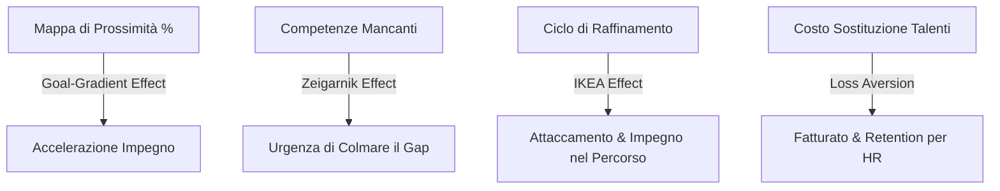

# Cardine — Strategia di Marketing e Posizionamento Psicologico

> **Data**: Giugno 2026  
> **Autore**: AI Antigravity  
> **Prodotto**: Cardine (Piattaforma B2B di Career Counseling basata su AI)  
> **Stato**: Strategia per il lancio dell'MVP (Fase 1)

---

## 1. Definizione del Posizionamento e "Jobs to Be Done" (JTBD)

Per costruire una strategia di marketing efficace per **Cardine**, dobbiamo innanzitutto chiarire quale "lavoro" (Job) i nostri clienti stanno assumendo (*hiring*) il prodotto per fare. Cardine opera in un mercato B2B (venduto alle aziende / HR) ma ha un impatto diretto sul B2C (i dipendenti che lo utilizzano).

### Il Job del Buyer B2B (HR Admin, CFO, CEO)
> **"Voglio ridurre le dimissioni volontarie dei talenti chiave e abbattere i costi di recruitment esterno, valorizzando le persone che ho già in azienda e mostrando loro un futuro chiaro."**
*   **Dolore principale**: La fuga dei dipendenti migliori (spesso motivata da "mancanza di opportunità di crescita interna") e il costo stratosferico per sostituirli (HR recruiting, onboarding, perdita di know-how).
*   **Perché Cardine risolve questo Job**: Invece di fare promesse vaghe, fornisce dati oggettivi sul matching delle competenze e un piano d'azione trasparente e concordato. **"Crescita interna, non mobilità esterna."**

### Il Job dell'Utente Finale (Il Dipendente)
> **"Voglio capire come fare carriera e ottenere una promozione/aumento all'interno di questa azienda, senza l'ansia di non sapere cosa mi manca o di dover cercare un altro lavoro fuori."**
*   **Dolore principale**: L'incertezza sul proprio futuro professionale, la sensazione di essere bloccati e la difficoltà di rispondere alla classica domanda del manager: *"Dove vuoi essere tra 5 anni?"* (a cui nessuno sa rispondere davvero).
*   **Perché Cardine risolve questo Job**: Riduce l'ansia trasformando una domanda esistenziale complessa in un calcolo matematico di prossimità delle competenze, seguito da una roadmap interattiva.

---

## 2. Applicazione dei Modelli Psicologici e di Persuasione

L'efficacia di Cardine risiede nell'integrazione di potenti bias cognitivi e modelli comportamentali sia nella sua interfaccia utente (UX) sia nella sua comunicazione di marketing.

### A. Superare la Paralisi Decisionale (Hick's Law & Paradox of Choice)
*   **Il Problema**: I cataloghi di e-learning aziendali tradizionali offrono migliaia di corsi, paralizzando i dipendenti (sovraccarico cognitivo).
*   **La Soluzione Cardine**: Cardine non mostra un catalogo vuoto. Mostra solo i **3 ruoli più vicini** (Proximity Map) e genera una roadmap di **soli 3-4 step specifici**. Meno scelte = più decisioni rapide e meno abbandono.

### B. Motivazione all'Azione (Goal-Gradient Effect)
*   **Il Principio**: Le persone accelerano il loro sforzo man mano che si avvicinano a un obiettivo.
*   **Applicazione in Cardine**: Mostrare che un dipendente è già al **78% di prossimità** da un ruolo target (es. Team Lead) è psicologicamente molto più potente rispetto a dire "ti mancano 3 competenze". Il dipendente sente di essere "quasi arrivato" e sarà fortemente motivato a completare il restante 22%.

### C. Creare Tensione Positiva (Zeigarnik Effect)
*   **Il Principio**: I compiti non completati o i "gap" aperti occupano la mente molto più dei compiti finiti.
*   **Applicazione in Cardine**: L'interfaccia visualizza i "Gap" (le competenze mancanti) come spazi vuoti o icone di avvertimento ambra (es. `◯ Gestione del Conflitto (mancante)`). Questa incompletezza visiva genera un "anello aperto" (open loop) che l'utente vuole istintivamente chiudere attivando la Roadmap.

### D. Coinvolgimento e Proprietà (IKEA Effect & Endowment Effect)
*   **Il Principio**: Le persone valutano molto di più ciò che hanno contribuito a costruire.
*   **Applicazione in Cardine**: Il **Ciclo di Raffinamento** permette al dipendente di personalizzare la roadmap (es. scrivendo *"Conosco già Agile, toglilo"*). Poiché il dipendente partecipa attivamente alla creazione del suo piano di crescita, ne sente la proprietà (*Endowment Effect*) ed è molto più probabile che lo porti a termine, riducendo l'abbandono dei corsi.

### E. Riduzione dell'Attrito (Activation Energy & BJ Fogg Model)
*   **Il Principio**: Il comportamento avviene quando Motivazione, Abilità e Prompt si incontrano. L'energia di attivazione iniziale deve essere minima.
*   **Applicazione in Cardine**: Tradizionalmente, mappare le proprie competenze richiede ore di compilazione di form noiosi. Cardine riduce l'energia di attivazione a zero: il profilo viene importato automaticamente via connettore (o caricato con un drag-and-drop del CV) e l'AI estrae tutto all'istante. L'utente deve solo guardare il risultato.

### F. Aumentare l'Urgenza B2B (Loss Aversion)
*   **Il Principio**: Il dolore di una perdita è psicologicamente due volte più forte del piacere di un guadagno equivalente.
*   **Applicazione nel Marketing B2B**: Nel pitch agli HR e ai CFO, non parleremo solo di *"migliorare il clima aziendale"*. Parleremo di perdite concrete:
    > *"Ogni volta che un tuo senior developer se ne va per mancanza di crescita interna, perdi €35.000 in costi diretti di recruitment e onboarding, oltre a 6 mesi di produttività. Cardine ti protegge da questa perdita costante."*

---

## 3. Strategia di Go-To-Market (GTM) per la Fase 1 (MVP)

Per lanciare l'MVP con un budget mirato, ci concentreremo su una strategia che fa leva sulla fiducia, l'autorità e la facilità di prova.

### 1. Pilota a "Frizione Zero" (Zero-Price Effect & Reciprocity)
Per rompere lo scetticismo iniziale sull'AI applicata all'HR:
*   Offrire un programma pilota gratuito di 30 giorni limitato a **un singolo dipartimento** (es. solo il team Engineering di un'azienda di 100-200 persone).
*   **Reciprocità**: L'azienda riceve gratuitamente la mappatura delle competenze del proprio team tech (un valore enorme); in cambio, fornisce feedback per l'ottimizzazione del prodotto e si impegna a discutere l'acquisto enterprise se i KPI di gradimento superano l'80%.

### 2. Leva dell'Autorità (Authority Bias)
L'HR è un settore conservatore e avverso al rischio.
*   Produrre whitepaper e case study tecnici dettagliati sull'uso di Azure OpenAI (conformità GDPR, data residency in Europa, isolamento dei dati per tenant). Questo elimina la principale obiezione dei dipartimenti IT aziendali.
*   Coinvolgere Career Counselor certificati nella definizione dei prompt dell'AI. Il messaggio di marketing deve essere: *"Cardine non sostituisce il Career Counselor, lo dota di superpoteri basati su dati scientifici"* (Pratfall Effect controllato).

### 3. Inversion Strategy (Prevenzione dei Fallimenti)
Per evitare che l'adozione fallisca (perché i dipendenti temono di essere "controllati" o giudicati dall'azienda):
*   **Messaggio di trasparenza**: Le roadmap non confermate e le simulazioni rimangono private nel profilo del Dipendente. Solo quando il Dipendente clicca su **"Conferma la Roadmap"**, i dati vengono condivisi con il Career Counselor per preparare il colloquio di sviluppo.
*   Questo rassicura l'utente sul controllo del proprio percorso professionale, evitando l'effetto "Grande Fratello".

---

## 4. Modello di Pricing Psicologico (B2B SaaS)

Il pricing deve rispecchiare il valore generato e facilitare la decisione d'acquisto. Proponiamo un modello **Good-Better-Best** (Price Relativity):

| Piano | Prezzo Indicativo | Target | Caratteristiche | Leva Psicologica |
| :--- | :--- | :--- | :--- | :--- |
| **Starter** | **€ 2 / utente / mese** | Piccole aziende (20-50 dipendenti) | Catalogo standard, fino a 30 roadmap attive, report base. | **Prezzo Civetta (Ancoraggio)**: Fa apparire il piano Professional estremamente conveniente per quello che offre. |
| **Professional** *(Consigliato)* | **€ 5 / utente / mese** | Medie aziende (50-250 dipendenti) | Catalogo personalizzabile, roadmap illimitate, dashboard Counselor, supporto standard. | **Decoy Effect / Compromise**: La maggior parte delle aziende sceglierà questo perché rappresenta il punto di equilibrio ideale. Meno di un caffè a dipendente. |
| **Enterprise** | **Custom (es. € 8+ / utente / mese)** | Grandi aziende (250+ dipendenti) | Integrazione HRIS (SAP, Workday), Single Sign-On, SLA garantito, Private Cloud. | **Leva di Status / Valutazione Qualità**: Le grandi aziende evitano i prezzi troppo bassi perché temono per la sicurezza e la stabilità. |

---

## 5. La North Star Metric (La Metrica Guida)

Il successo di Cardine non si misura solo dal numero di licenze vendute, ma dall'effettivo utilizzo che ne convalida il rinnovo contrattuale (*Retention*).

*   **North Star Metric**: **"Roadmap Attive Confermate per Mese"**
    *   *Perché*: Una roadmap confermata indica che il dipendente ha trovato valore nella mappatura (Motivation), ha ridotto la complessità grazie all'AI (Ability) e ha preso un impegno formale con l'azienda (Commitment & Consistency). Per l'HR, questo è il segnale tangibile che la piattaforma sta funzionando e riducendo il rischio di abbandono.
